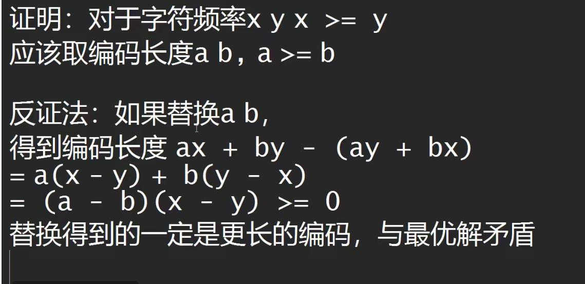

#哈夫曼编码

##前缀码

###举例

常规： 定长编码：m:00 i:01 s:10 p:11

得到： 0001101001101001111101

编码长度：22

###哈夫曼编码设计

1.计算每个字母出现的频率：

        m:1
        p:2
        i:4
        s:4

2.构建哈夫曼树

取频率最小的两个数，构成左右树节点，取两数的和为父节点，直到所有数取完。

###证明哈夫曼编码

对于频率越长取的越短，反证时假设反过来

