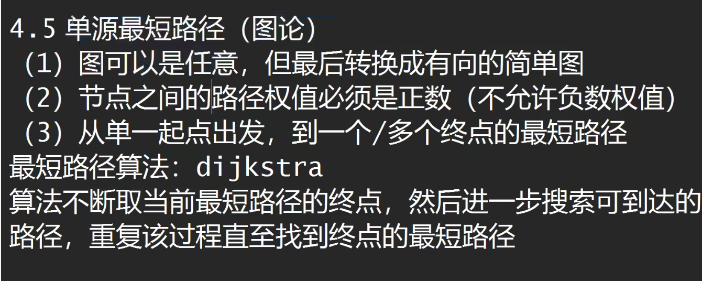

#单源最短路径

本关任务：全国人民都盼望着疫情早日结束，到时可以多出去走动，到各个城市看一看，在“双十一”来临之际，规划一条到目的地的最便宜航线吧！

有 n 个城市通过一些航班连接。给你一个数组 flights ，其中 flights[i] = { start(i), end(i), price(i) } ，表示该航班都从城市 start(i) 开始，以价格 price(i) 抵达 end(i)。

现在给定所有的城市和航班，以及出发城市 src 和目的地 dst，你的任务是找到一条中转的路线，使得从 src 到 dst 的 总价格最便宜 ，并返回该价格。 题目保证了这样的路线一定存在。

相关知识
为了完成本关任务，你需要掌握：

OOP基础，能够很好的使用对象
数据结构基础，能够很好地预处理输入数据
熟练掌握dijkstra算法并将其代码实现
对于dijkstra算法，如果觉得还未完全掌握，可以参考一些网上文章，例如：【看完必懂】Dijkstra算法（附案例详解）

编程要求
根据提示，在右侧编辑器补充代码，计算并返回从起点到终点的最便宜总票价。

测试说明
平台会对你编写的代码进行测试，直接比对正确答案并输出 pass 或 fail 或 超时，只有规定时间内 pass 所有用例才能通过本关。

提示：

1 <= n <= 100
0 <= flights.length <= (n * (n - 1) / 2)
flights[i] 为一个 Flight对象(属性包含start, end, price)
0 <= start(i), end(i) < n
start(i) != end(i) (即不会飞回原地)
1 <= price(i) <= 10000
航班没有重复，且不存在自环
0 <= len(set(src, dst)) < n
src != dst (即起点与终点必定不一样)
所有样例均保证一定有解
